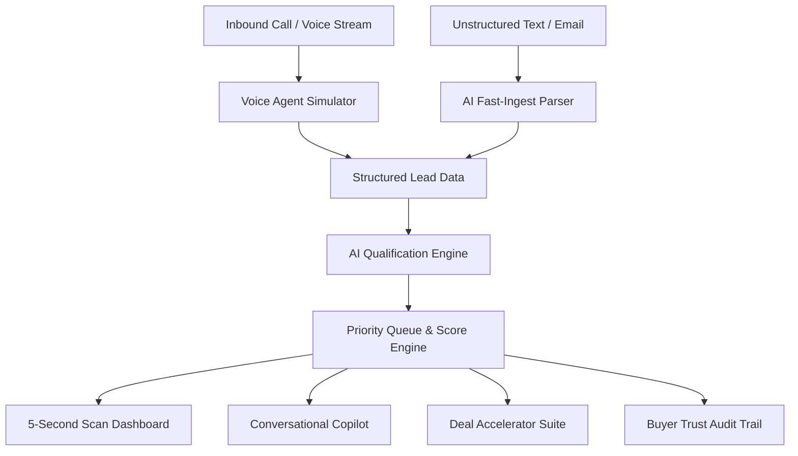

# 🏢 LeadPulse AI — Real Estate Voice & Lead Intelligence Copilot

> **Masal AI Forward Deployed Engineer (FDE) Assignment **  
> An AI-powered web application and voice intelligence copilot built for forward deployed engineers sitting between product and real estate customers: configuring, demoing, troubleshooting, and qualifying inbound leads live on client calls.

---

## 🎯 Role Context: Forward Deployed Engineer (FDE) Focus

In real-world deployment calls with non-technical real estate agency owners, brokers, and sales directors, an FDE must do two things simultaneously:
1. **Build and demonstrate working software live** that solves inbound lead prioritization in seconds.
2. **Explain complex AI behavior clearly enough that non-technical buyers trust it.**

LeadPulse AI is built from the ground up for this workflow.

---

## ⚡ Core Features & FDE Capabilities

### 1. 🎙️ Live Voice Agent Call Simulator (Interactive Audio Demo)
- **Real-Time Speech Synthesis**: The browser literally speaks the AI voice concierge's dialogue aloud in real time using native speech synthesis.
- **Visual Waveform & Turn-Taking**: Displays active audio waveforms, speaker badges, and live call transcripts.
- **FDE Telemetry Bar**: Shows live diagnostic metrics: latency (`280ms`), audio codec (`24kHz HD`), and telephony connection state.
- **1-Click Call Ingestion**: Automatically ingests the completed voice call into the CRM pipeline with structured AI extraction.

### 2. ⚙️ Voice System Live Configurator & Diagnostics
- **Live Client Tuning on Calls**: The FDE can adjust the voice agent's tone (*Warm Consultative*, *Concise & Fast*, *Luxury Advisory*), speech cadence, and prompt instructions directly on a screen-share call.
- **Automated Escalation Thresholds**: Set minimum budget triggers (e.g., `$1,500,000`) for immediate human broker transfer.
- **Anti-Hallucination Guardrails**: Visual badge and telemetry verifying verified MLS listing enforcement.

### 3. 🛡️ Buyer Trust & AI Explainability Audit
- Non-technical buyers often distrust AI as an arbitrary "black box."
- Clicking **"Explain Score (Audit)"** breaks down any lead's score (e.g., 96/100) into plain-English attribution drivers:
  - `+25 pts`: Verified all-cash capability (eliminates mortgage contingency).
  - `+20 pts`: Immediate 14–20 day closing window.
  - `+15 pts`: High commission pool.
  - `+10 pts`: Precise physical property requirements.
- **Grounded Transcript Citations**: Directly highlights the exact sentences from the customer inquiry that triggered the score.

### 4. 📋 Inbound Lead Intake & AI Fast-Ingest
- Multi-field structured capture (Name, Location, Specs, Budget, Timeline, Message).
- **AI Auto-Extract**: Paste any messy, unformatted email inquiry, WhatsApp chat log, or call transcript, and the AI parses all fields in 1 click.
- **Realistic Scenario Presets**: High-Net-Worth Cash Buyer, Suburban Family Relocation, First-Time Condo Buyer, 1031 Exchange Investor.

### 5. 🧠 5-Second Scan Lead Intelligence
- **AI Lead Score (0–100)**: Quantitative ranking.
- **Priority Tiering**: `🔥 HOT` (80–100), `⚡ WARM` (50–79), `❄️ NURTURE` (<50).
- **Customer Intent**: Pinpoints unspoken motivation (e.g. *Liquidity Event Relocation*, *School District Catchment*).
- **Key Requirements vs Objections**: Side-by-side risk and constraint analysis.
- **Recommended Next Action**: Tactical high-priority directive.
- **Suggested Response**: Pre-drafted customer message ready for 1-click copy or dispatch.

### 6. 💬 Grounded Conversational Copilot
- Interactive chat attached to the active lead, grounded strictly in their constraints and psychology.
- Quick prompts: *"What to emphasize on the call?"*, *"Make my reply more assertive"*, *"Handle rate anxiety"*, *"Roleplay as the buyer"*.

### 7. 🚀 Deal Accelerator Suite™ (Invented Feature)
- **Live Phone Battlecard**: Psychological archetype and verbatim **7-Second Call Opener**.
- **Live Objection Rebuttals**: Exact "Say this" scripts for common pushbacks.
- **Smart Inventory Matcher**: Matches lead specs against active listings with tailored value hooks.
- **1-Click Multi-Channel Dispatch**: Pre-filled WhatsApp (`wa.me`) and Email (`mailto:`) links.

---

## 🏗️ Architecture Overview



### Tech Stack
- **Frontend**: React 18, Vite, Tailwind CSS
- **Icons**: Lucide React
- **Audio & Speech**: Browser Web Speech API (`SpeechSynthesis`)
- **AI Models**: Google Gemini 1.5 Flash (`gemini-1.5-flash`), Groq Cloud (`llama-3.3-70b-versatile`), and High-Fidelity Zero-Setup Heuristic Engine.
- **Deployment**: Vercel ready with [`vercel.json`](./vercel.json).

---

## 🚀 Running Locally

```bash
# 1. Clone repository
git clone https://github.com/TANISHQDAS/MASAL.AI.git
cd MASAL.AI

# 2. Install dependencies
npm install

# 3. Start dev server
npm run dev
```
Open **`http://localhost:3000`** in your browser.

---

## 🤖 AI Usage Disclosure (Submission Requirement #4)

- **Gemini 1.5 / 2.0 API**: Used for production real-time structured lead scoring, unstructured transcript parsing, grounded conversational sales copilot replies, and objection battlecards.
- **Claude & Gemini Coding Assistants**: Used for system prompt engineering, JSON schema formatting, architectural modularization, and initial React component scaffolding.
