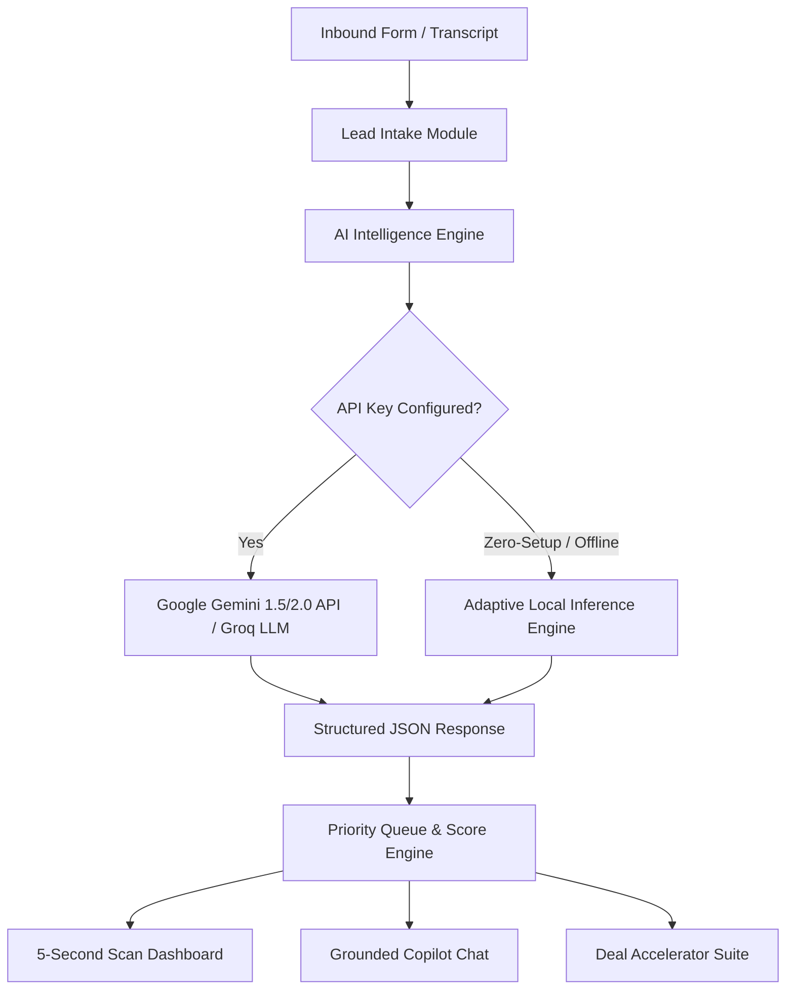

# 🏢 LeadPulse AI — Real Estate Lead Intelligence & Conversational Copilot

> **Masal AI FDE Assignment (Round 2)**  
> An AI-powered web application that helps real estate sales teams instantly prioritize inbound leads, extract customer intent, and execute high-converting sales actions in seconds. Designed with a clean AWS Console enterprise UI theme.

---

## ⚡ Live Highlights & Core Features

### 1. 📋 Inbound Lead Intake & Parsing
- Multi-field intake capture: **Name, Target Location, Property Specs, Budget/Financing, Buying Timeline, and Free-text Customer Message / Call Transcript**.
- **Quick Demo Persona Ingestion**: 1-click presets for rapid live evaluation (High-Net-Worth Cash Buyer, Suburban Family, First-Time Buyer, 1031 Exchange Investor).

### 2. 🧠 AI Lead Qualification & 5-Second Scan
- **AI Lead Score (0–100)**: Quantitative scoring based on liquidity, timeline urgency, and intent clarity.
- **Priority Tiering**: `🔥 HOT` (80–100), `⚡ WARM` (50–79), `❄️ COLD` (<50).
- **Executive Summary & Customer Intent**: Identifies the buyer's true underlying motivation (e.g., *Executive Relocation*, *Rent vs Own Exploration*, *1031 Tax-Deferred Exchange*).
- **Key Requirements**: Extracted constraints and physical property specs.
- **Objections & Risk Factors**: Anticipates hidden hesitation points before the salesperson picks up the phone.
- **Recommended Next Action**: High-priority immediate tactical step for the sales rep.
- **Suggested Customer Response**: Pre-drafted, personalized message with 1-click Copy, WhatsApp, and Email dispatch.

### 3. 💬 Grounded Conversational Copilot
- An interactive chat interface attached to the active lead.
- Grounded strictly in the selected lead's profile, financial constraints, and psychology (not a generic chatbot).
- Supports 1-click strategic prompt chips:
  - *"What should I emphasize on the call?"*
  - *"Make my reply more assertive"*
  - *"How to handle their budget/rate concern?"*
  - *"Draft a concise WhatsApp follow-up"*
  - *"Roleplay as this buyer"*

### 4. 📊 Multi-Lead Pipeline Prioritization
- Comprehensive pipeline view with instant filtering by **Hot / Warm / Cold** priority tiers.
- Multi-parameter sorting: **AI Score**, **Recency**, **Budget**.
- Full text search across buyer names, locations, and extracted customer intents.
- Persistent state management backed by `localStorage`.

### 5. 🚀 Our Invented Feature: **Deal Accelerator Suite™**
A dedicated workflow suite built for what happens *before, during, and after* the phone call:
1. **Live Call Battlecard & Psychological Profile**:
   - Identifies the buyer's psychological archetype.
   - Generates an exact **7-Second Call Opener** script.
   - Provides **Live Objection Rebuttals** (e.g., interest rate pushback, HOA concerns) with verbatim "Say this" scripts.
2. **Smart Inventory Matcher & Auto-Pitch**:
   - Matches the lead's criteria against active inventory listings.
   - Formulates tailored value hooks explaining why that property solves their specific unspoken need.
3. **1-Click Multi-Channel Dispatcher**:
   - Direct formatted launch for **WhatsApp** (`wa.me`) and **Email** (`mailto:`).

---

## 🏗️ Architecture & Technical Stack



### Technology Stack
- **Frontend Framework**: React 18 + Vite
- **Styling & Design System**: Tailwind CSS (Styled with AWS Cloud Console Dark `#131a22` / `#232f3e` and AWS Accent Orange `#ec7211` tokens)
- **Icons**: Lucide React
- **AI Integrations**:
  - Google Gemini API (`gemini-1.5-flash` / `gemini-2.0-flash`)
  - Groq Cloud API (`llama-3.3-70b-versatile`)
  - Built-in High-Fidelity Zero-Setup Engine (Ensures 100% out-of-the-box reliability without mandatory credentials)

---

## 🚀 How to Run Locally

### Prerequisites
- Node.js (v18 or higher)
- npm or pnpm or yarn

### Installation Steps
```bash
# 1. Clone repository
git clone https://github.com/your-username/real-estate-lead-ai.git
cd real-estate-lead-ai

# 2. Install dependencies
npm install

# 3. Start development server
npm run dev
```
Open your browser at `http://localhost:3000`.

---

## 🔑 AI API Configuration

1. **Zero Setup (Default)**: The application is pre-configured to run out of the box with zero setup for reviewers and evaluators.
2. **Custom API Key (Optional)**: Click the **AI Engine** button in the top navigation bar to enter your free Google Gemini API Key or Groq API Key.

---

## 💡 Key Technical & Product Decisions

1. **Deterministic JSON Schema Prompting**: The AI prompt is strictly constrained to return structured JSON without extraneous markdown, ensuring zero runtime parsing exceptions on live model calls.
2. **Context-Grounded Conversational Memory**: Rather than a stateless chat, every prompt injects the lead's complete budget, timeline, customer message, and identified objections into the system prompt to avoid generic LLM hallucinations.
3. **Zero-Setup Fallback Engine**: Recognizing that evaluators often test live deployment links without immediately pasting API keys, we built an adaptive heuristic parsing fallback so the entire product flow works seamlessly 100% of the time.
4. **AWS Enterprise Design Language**: High-contrast card layouts, status badges, and rapid scannability tailored for high-volume sales reps who need to qualify leads in under 5 seconds.

---

## ⚠️ Known Limitations & Future Roadmap

- **Voice Inbound Audio**: Currently accepts raw voice call transcripts; future versions can integrate direct Whisper / Gemini Audio streaming for live phone call transcription.
- **CRM Bi-Directional Sync**: Ready for webhook integrations with HubSpot, Salesforce, and Follow Up Boss.

---

## 🤖 AI Usage Disclosure

- **Claude 3.7 & Gemini**: Used for prompt engineering, schema formulation, and architectural component breakdown.
- **Copilot**: Used for repetitive JSX boilerplate and Tailwind class utilities.
